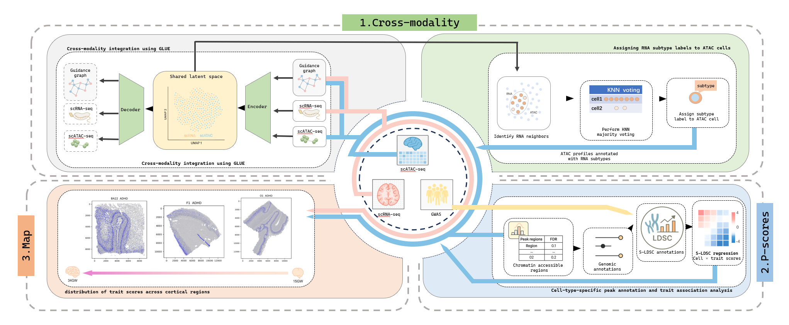

# Overview

**scBrain-TraitMap** is a streamlined and reproducible framework for integrating **single-cell RNA-seq (scRNA-seq)**, **single-cell ATAC-seq (scATAC-seq)**, and **GWAS data** into a unified analytical pipeline. Built on the SCGLUE model, the framework aligns transcriptomic and epigenomic cells into a shared latent space, enabling subtype transfer, peak-level annotation, and downstream trait–cell-type mapping.



The framework provides:

- A script-based, modular pipeline with a clean directory structure (`./data`, `./model`, `./logs`).
- Automated preprocessing, PCA/LSI computation, and harmonized cell-type annotations.
- Cross-modality integration of scRNA-seq and scATAC-seq using SCGLUE with a user-supplied guidance graph.
- KNN-based label transfer from RNA to ATAC cells within the shared embedding.
- Extraction of cell-type–specific accessible peaks for S-LDSC enrichment analysis.
- Easy hyperparameter tuning through both command-line arguments and in-script defaults.
- Reproducible execution with transparent logging and version control.

scBrain-TraitMap is designed for researchers aiming to study cell-type–resolved regulatory landscapes and to map complex-trait associations onto specific neural populations in the human brain.


## 1. Building the Guidance Graph

This notebook generates the *guidance graph* required for SCGLUE-based cross-modality integration.  
The graph encodes regulatory relationships between genes (from scRNA-seq) and chromatin-accessible regions (from scATAC-seq), and serves as the structural prior that anchors the two modalities in a shared latent space.

The workflow includes:

- Loading subsampled scRNA-seq and scATAC-seq datasets (`rna_subsampled.h5ad`, `atac_subsampled.h5ad`)
- Extracting gene coordinates using a GTF annotation (lifted to hg19)
- Parsing ATAC peaks into chromosome-based genomic intervals
- Constructing an RNA-anchored guidance graph using SCGLUE’s regulatory rules
- Sanitizing metadata to ensure H5AD compatibility
- Exporting the graph in both `.graphml.gz` (human-readable) and `.gpickle` (Python-native) formats

This guidance graph is the only structural prior required by the SCGLUE training script (`2.run_scglue.py`), and defines how genes and peaks are linked during cross-modality alignment.

## 2. SCGLUE Cross-Modality Integration (`2.run_scglue.py`)

This script performs the complete SCGLUE workflow to integrate subsampled scRNA-seq and scATAC-seq profiles into a unified latent embedding. Unlike the original SCGLUE implementation that timestamps model runs, this pipeline produces **deterministic, timestamp-free outputs** for full reproducibility.

### Workflow summary

This script performs the following steps:

1. **Load input data**
   - `rna_subsampled.h5ad`
   - `atac_subsampled.h5ad`
   - `guidance.graphml.gz`

2. **Graph preprocessing**
   - Add self-loops to all nodes
   - Ensure edge attributes (`weight`, `sign`) are present

3. **Metadata cleanup**
   - Normalize categorical fields
   - Ensure `.X` contains finite values
   - Set `highly_variable` flags if missing

4. **Feature representation**
   - Compute PCA for RNA (default: 50 components)
   - Compute LSI for ATAC (default: 50 components)
   - Optionally filter ATAC peaks to those present in the guidance graph

5. **Cell-type harmonization**
   - Map fine-grained RNA labels (e.g., `EN-ET`, `IN`, `OPC`) to coarse labels
   - Map ATAC cluster labels to the same set of categories
   - Store final labels in `glue_cell_type`

6. **Configure SCGLUE datasets**
   - RNA modeled with a Normal likelihood (`Normal`)
   - ATAC modeled with a Zero-Inflated Log-Normal likelihood (`ZILN`)
   - Use PCA/LSI features and HV feature masks

7. **Train SCGLUE**
   - All hyperparameters are configurable via CLI flags:
     - `--max_epochs` (default: 100)
     - `--batch_size` (default: 256)
     - `--align_burnin` (default: 30)
     - `--graph_batch` (default: 7500)
   - All logs are written to `./logs/glue.log`

8. **Embedding and visualization**
   - Encode RNA and ATAC into `X_glue`
   - Compute joint UMAP embedding
   - Produce separate UMAP plots for RNA-only and ATAC-only cells

9. **Save outputs**
   - Trained SCGLUE model (`glue_model.dill`)
   - RNA/ATAC `.h5ad` files containing the `X_glue` embedding
   - UMAP visualizations:
     - `umap_rna.png`
     - `umap_atac.png`
   - All logs stored in `logs/glue.log`

### Running the script

Run with default hyperparameters:

```bash
python 2.run_scglue.py
```

Customize hyperparameters:

```bash
python 2.run_scglue.py \
    --n_comps 64 \
    --max_epochs 150 \
    --batch_size 128 \
    --graph_batch 5000 \
    --align_burnin 20
```

### Hyperparameter reference

| Parameter         | CLI Flag          | Default | Description |
|------------------|-------------------|---------|-------------|
| `n_comps`        | `--n_comps`       | 50      | Number of PCA/LSI components. |
| `max_epochs`     | `--max_epochs`    | 100     | Maximum training epochs. |
| `batch_size`     | `--batch_size`    | 256     | RNA/ATAC mini-batch size. |
| `graph_batch`    | `--graph_batch`   | 7500    | Number of edges sampled per graph batch. |
| `patience`       | `--patience`      | 20      | Early-stopping patience. |
| `lr_patience`    | `--lr_patience`   | 15      | LR schedule patience. |
| `align_burnin`   | `--align_burnin`  | 30      | Epochs to delay cross-modality alignment. |

### Output structure (timestamp-free)

```
model/
    glue_run/
        glue_model.dill
        umap_rna.png
        umap_atac.png
        rna_with_Xglue.h5ad
        atac_with_Xglue.h5ad

logs/
    glue.log
```

"""
==============================================================
Part 3 — SCGLUE Embedding Loading & subCluster Harmonization
==============================================================

This script performs the following functions:

1. -----------------------------------------------------------
   Resolve project structure
   -----------------------------------------------------------
   - Automatically locates:
        model/glue_run/rna_with_Xglue.h5ad
        model/glue_run/atac_with_Xglue.h5ad
   - Ensures paths are correct under the project root.
   - Prints the resolved file paths for reproducibility.

2. -----------------------------------------------------------
   Load RNA / ATAC AnnData objects
   -----------------------------------------------------------
   - Loads both modalities using anndata.read_h5ad().
   - Prints basic shape information:
        RNA : (n_cells, n_genes)
        ATAC: (n_cells, n_peaks)

3. -----------------------------------------------------------
   Standardize RNA subCluster annotation
   -----------------------------------------------------------
   Why this step?
   - Some RNA cells have "Unknown" subCluster labels.
   - The glue alignment requires consistent, meaningful
     biological labels.
   - If H2_annotation exists, use it to replace "Unknown".

   Steps:
   - Check presence of rna.obs["subCluster"].
   - Convert to string type.
   - Replace "Unknown" using H2_annotation if available.
   - Print the updated subCluster frequency table.

4. -----------------------------------------------------------
   Verify SCGLUE embeddings ("X_glue")
   -----------------------------------------------------------
   SCGLUE produces a shared embedding for cross-modality mapping.
   This step ensures:
   - Both RNA and ATAC contain obsm["X_glue"].
   - Their embedding dimensionality matches.

   This is essential before running:
     • KNN label transfer
     • Cell-type assignment refinement
     • Peak set selection and LDSC analysis

5. -----------------------------------------------------------
   Output
   -----------------------------------------------------------
   After this script:
   - RNA.obs["subCluster"] is clean and usable.
   - RNA / ATAC embeddings are loaded.
   - Both modalities now share the same 50D SCGLUE latent space.

This script is the foundation for downstream steps:
✓ KNN voting-based label transfer  
✓ multi-stage assignment pipeline (strict → relaxed → fallback)  
✓ ATAC peak specificity scoring  
✓ generation of cluster-specific LDSC peak sets  

==============================================================
"""

