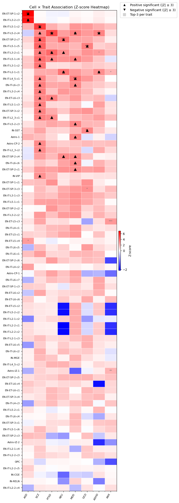
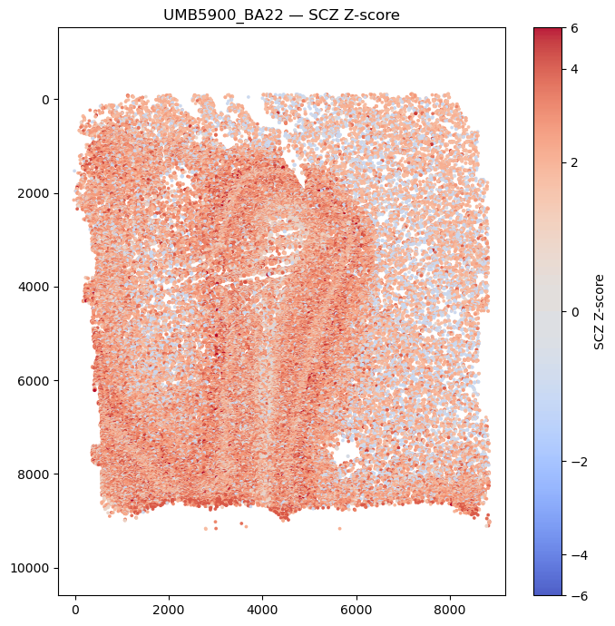

# Overview

**scBrain-TraitMap** is a streamlined and reproducible framework for integrating **single-cell RNA-seq (scRNA-seq)**, **single-cell ATAC-seq (scATAC-seq)**, and **GWAS data** into a unified analytical pipeline. Built on the SCGLUE model, the framework aligns transcriptomic and epigenomic cells into a shared latent space, enabling subtype transfer, peak-level annotation, and downstream trait–cell-type mapping.


The framework provides:

- A script-based, modular pipeline with a clean directory structure (`./data`, `./model`, `./logs`).
- Automated preprocessing, PCA/LSI computation, and harmonized cell-type annotations.
- Cross-modality integration of scRNA-seq and scATAC-seq using SCGLUE with a user-supplied guidance graph.
- KNN-based label transfer from RNA to ATAC cells within the shared embedding.
- Extraction of cell-type–specific accessible peaks for S-LDSC enrichment analysis.
- Easy hyperparameter tuning through both command-line arguments and in-script defaults.
- Reproducible execution with transparent logging and version control.

scBrain-TraitMap is designed for researchers aiming to study cell-type–resolved regulatory landscapes and to map complex-trait associations onto specific neural populations in the human brain.

This project uses two separate Conda environments, reflecting the different dependencies required for SCGLUE-based multimodal integration and LDSC partitioned heritability analyses.

A. glue environment
Used for:
- 1. Building the Guidance Graph (1.build_guidance_graph.ipynb)
- 2. SCGLUE Cross-Modality Integration (2.run_scglue.py)
- 3. Label Transfer and Peak Selection (3.label_transfer_and_peak_selection.ipynb)
- 5. Cluster × Trait Heatmap Analysis (5.hotmap.ipynb)

Key packages in the glue environment:
- Python 3.x
- scanpy 1.9.8
- scglue 0.4.0
- anndata 0.11.4
- muon 0.1.7
- matplotlib 3.10.6
- seaborn 0.13.2
- numpy 1.24.4
- scipy 1.10.1
- pandas 2.0.3
- torch 2.2.2
- umap-learn 0.5.9
- pybedtools 0.12.0
- pysam 0.23.3

B. ldsc_py2 environment
Used exclusively for:
- 4. LDSC Pipeline (4.run_ldsc_pipeline.sh)

Key packages in the ldsc_py2 environment:
- Python 2.7
- numpy 1.16.6
- scipy 1.2.1
- pandas 0.24.2
- bitarray 0.9.3
- pybedtools 0.7.10
- pysam 0.17.0

Notes:
- The two environments are intentionally isolated because LDSC requires legacy Python dependencies.
- Users replicating the pipeline should recreate both environments for full reproducibility.

## 1. Building the Guidance Graph(1.build_guidance_graphy.ipynb)

This notebook generates the *guidance graph* required for SCGLUE-based cross-modality integration.  
The graph encodes regulatory relationships between genes (from scRNA-seq) and chromatin-accessible regions (from scATAC-seq), and serves as the structural prior that anchors the two modalities in a shared latent space.

The workflow includes:

- Loading subsampled scRNA-seq and scATAC-seq datasets (`rna_subsampled.h5ad`, `atac_subsampled.h5ad`)
- Extracting gene coordinates using a GTF annotation (lifted to hg19)
- Parsing ATAC peaks into chromosome-based genomic intervals
- Constructing an RNA-anchored guidance graph using SCGLUE’s regulatory rules
- Sanitizing metadata to ensure H5AD compatibility
- Exporting the graph in both `.graphml.gz` (human-readable) and `.gpickle` (Python-native) formats

This guidance graph is the only structural prior required by the SCGLUE training script (`2.run_scglue.py`), and defines how genes and peaks are linked during cross-modality alignment.

## 2. SCGLUE Cross-Modality Integration (`2.run_scglue.py`)

This script performs the complete SCGLUE workflow to integrate subsampled scRNA-seq and scATAC-seq profiles into a unified latent embedding. Unlike the original SCGLUE implementation that timestamps model runs, this pipeline produces **deterministic, timestamp-free outputs** for full reproducibility.

### Workflow summary

This script performs the following steps:

1. **Load input data**
   - `rna_subsampled.h5ad`
   - `atac_subsampled.h5ad`
   - `guidance.graphml.gz`

2. **Graph preprocessing**
   - Add self-loops to all nodes
   - Ensure edge attributes (`weight`, `sign`) are present

3. **Metadata cleanup**
   - Normalize categorical fields
   - Ensure `.X` contains finite values
   - Set `highly_variable` flags if missing

4. **Feature representation**
   - Compute PCA for RNA (default: 50 components)
   - Compute LSI for ATAC (default: 50 components)
   - Optionally filter ATAC peaks to those present in the guidance graph

5. **Cell-type harmonization**
   - Map fine-grained RNA labels (e.g., `EN-ET`, `IN`, `OPC`) to coarse labels
   - Map ATAC cluster labels to the same set of categories
   - Store final labels in `glue_cell_type`

6. **Configure SCGLUE datasets**
   - RNA modeled with a Normal likelihood (`Normal`)
   - ATAC modeled with a Zero-Inflated Log-Normal likelihood (`ZILN`)
   - Use PCA/LSI features and HV feature masks

7. **Train SCGLUE**
   - All hyperparameters are configurable via CLI flags:
     - `--max_epochs` (default: 100)
     - `--batch_size` (default: 256)
     - `--align_burnin` (default: 30)
     - `--graph_batch` (default: 7500)
   - All logs are written to `./logs/glue.log`

8. **Embedding and visualization**
   - Encode RNA and ATAC into `X_glue`
   - Compute joint UMAP embedding
   - Produce separate UMAP plots for RNA-only and ATAC-only cells

9. **Save outputs**
   - Trained SCGLUE model (`glue_model.dill`)
   - RNA/ATAC `.h5ad` files containing the `X_glue` embedding
   - UMAP visualizations:
     - `umap_rna.png`
     - `umap_atac.png`
   - All logs stored in `logs/glue.log`

### Running the script

Run with default hyperparameters:

```bash
python 2.run_scglue.py
```

Customize hyperparameters:

```bash
python 2.run_scglue.py \
    --n_comps 64 \
    --max_epochs 150 \
    --batch_size 128 \
    --graph_batch 5000 \
    --align_burnin 20
```

### Hyperparameter reference

| Parameter         | CLI Flag          | Default | Description |
|------------------|-------------------|---------|-------------|
| `n_comps`        | `--n_comps`       | 50      | Number of PCA/LSI components. |
| `max_epochs`     | `--max_epochs`    | 100     | Maximum training epochs. |
| `batch_size`     | `--batch_size`    | 256     | RNA/ATAC mini-batch size. |
| `graph_batch`    | `--graph_batch`   | 7500    | Number of edges sampled per graph batch. |
| `patience`       | `--patience`      | 20      | Early-stopping patience. |
| `lr_patience`    | `--lr_patience`   | 15      | LR schedule patience. |
| `align_burnin`   | `--align_burnin`  | 30      | Epochs to delay cross-modality alignment. |

### Output structure (timestamp-free)

```
model/
    glue_run/
        glue_model.dill
        umap_rna.png
        umap_atac.png
        rna_with_Xglue.h5ad
        atac_with_Xglue.h5ad

logs/
    glue.log
```

"""
## 3. Label Transfer and Specific Peak Selection(3.label_transfer_and_peak_selection.ipynb)

This script loads the SCGLUE-integrated RNA/ATAC data, cleans RNA subCluster labels,
and assigns ATAC cells to RNA subClusters using SCGLUE embeddings through a three-step
procedure (strict KNN voting → relaxed reassignment → centroid fallback). The resulting
labels are stored as `assigned_subCluster_v2`, together with confidence and assignment
stage. Using these transferred labels, the script then identifies cluster-specific ATAC
peaks by computing within-cluster prevalence, log2 fold-change, and Jensen–Shannon
divergence, followed by a relaxed fallback strategy to ensure each cluster has sufficient
peaks. All selected peaks are written as BED files under `ldsc_peaksets/`, together with
`specific_peak_counts.tsv` for downstream LDSC partitioned heritability analysis.
"""

## 4.LDSC Pipeline (4.run_ldsc_pipeline.sh)

Requirements:
- User must prepare LDSC reference files manually:
  - ldsc.py (Python2 version)
  - 1000 Genomes Phase 3 EUR PLINK files: 1000G.EUR.QC.{bed,bim,fam}
  - HapMap3 SNP list: w_hm3.snplist
  - Baseline annotation: baseline_plus_EC.hm3pruned.{1..22}.l2.ldscore.gz
  - LD weights: weights.hm3_noMHC.{1..22}.l2.ldscore.gz

Environment:
- Must use Python2 environment (LDSC official requirement)
- Required packages: numpy, scipy, pandas, bitarray, six
- System tools required: bedtools, gzip, awk, sed, xargs, bash>=4.0

Usage:
1. Prepare cell-type-specific BED files (from Step 3)
2. Prepare LDSC-formatted GWAS summary statistics
3. Edit paths at top of run_ldsc_pipeline.sh
4. Run:
   ```bash
   bash run_ldsc_pipeline.sh
   ```
6. Output will be saved to the ldsc folder:
   - Per-cell per-GWAS h2 results
   - Combined matrices: combined_z.tsv, combined_coef.tsv, combined_se.tsv


## 5. Cluster × Trait Hotmap Analysis (5.hotmap.ipynb)
This notebook visualizes cell-type × trait associations derived from LDSC results and projects selected traits back onto spatial coordinates.
 Notes:
   • All figures are computed from the example dataset.
   • Example demonstration figures (not identical to your results):




These are dome only and will differ from your scientific results.


